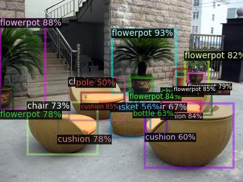
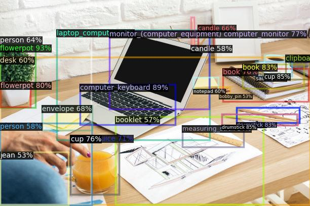
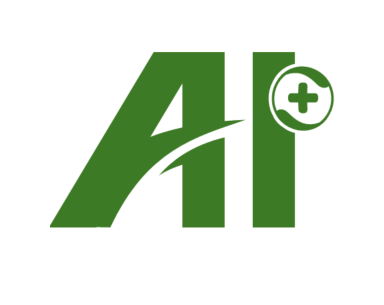

# Open Vocabulary Detection Contest - 开放世界目标检测竞赛 2023
hosted by 360 AI Institute

---
## 竞赛目的与意义

目标检测是计算机视觉中的核心任务之一，主要目的是让计算机可以自动识别图片中目标的类别，并标示出每个目标的位置。当前主流的目标检测方法主要针对闭集目标开发，即在整个任务前期需要对待检测目标进行类别定义，并进行人工数据标注，通过有监督模型训练使模型达到目标检测的目的。这一方式可以处理的待检测目标通常限定在几十类以内。但是当需要检测的目标类别增加到几千、万类时，上述方式在数据标注环节上已无法应对。与此同时，已训练模型也无法应对新的类别。当有新的类别出现时，需要手动进行标注并再次训练该模型，整体效率较低。

开放词集目标检测（Open Vocabulary Detection, OVD）提供了解决上述问题的新思路。借助于现有跨模态模型（CLIP[1]、ALIGN[2]、[R2D2](https://github.com/yuxie11/R2D2)[3] 等）的泛化能力，OVD可以实现以下功能：

1）对已定义类别的few shot检测；

2）对未定义类别的zero-shot检测。

开放词集目标检测有望成为未来目标检测算法开发的新范式。

<!-- *加入示意图/框图* -->
<!--  -->

---
## 任务设置

参赛者将运用OVD相关的方法，对图像中的商品目标进行检测。对于一件商品，我们会给出它的图片以及bbox作为训练数据。

目标类别有两类：base类和novel类。类别均为中文商品词组。base类的目标提供少量已标注的训练样本，novel类的目标则没有训练样本。评测分别在base类的测试集和novel类的测试集上进行，评测指标为novel和base类的mAP@50，竞赛按照novel和base类别的整体mAP@50排序。

<!-- 注：初赛和复赛使用的base及novel类别均没有重复。 -->

<!-- *补充细节* -->

---
## 奖项设置和奖励方法

* 一等奖：1支参赛队伍，奖金3万元
* 二等奖：2支参赛队伍，奖金各1万元
* 三等奖：3支参赛队伍，奖金各5千元     
* 决赛获胜队伍将在[ICIG2013大会](http://icig2023.csig.org.cn/)上进行方案分享演讲

---
## 主要时间节点

|  阶段 |   时间 |   说明  |
|------|---------|-----------|
|  线上报名	| 4/12 ~ 6/30  |   [报名注册](data.md) |
|  初赛	| 4/12 ~ 6/30  |        -     |
|  初赛评审和复赛入围结果公布	| 6/30 ~ 7/14  |  -    |
|  复赛	| 7/14 ~ 8/20   |   -   |
|  复赛评审和结果公布	| 8/20 ~ 9/10  |   -    |
|  颁奖	| 9/22 ~ 9/24  |  -     |

---
## 竞赛参与者要求

1. 参赛者可以自由组队，每队不限人数
2. 每位参赛者只能参加一只队伍
3. 初赛和复赛期间，每个队伍单日限制提交2次结果
<!-- 注册请前往[数据下载页](data.md) -->

---
## 竞赛组织

开放世界目标检测竞赛由360人工智能研究院联合中国图形图象学会共同举办。    

360人工智能研究院成立于2015年，我们聚焦于研发业界领先的计算机视觉、深度自然语言理解、语音语义交互、大规模深度学习、机器人运动等人工智能技术，并应用于智慧物联网（IOT）、智能安全大数据、互联网信息分发、企业数字化、智能汽车等多种场景。
团队多次在国际大赛中取得优异成绩，承担过国家和北京市多个重点攻关项目，参与建设国家级重点大数据工程实验室，参与建设的安全大脑入选国家新一代人工智能开放创新平台。我们打造的算法和服务，已应用于多条业务线，支持千万级硬件设备，亿级用户，产生的数据量达千亿规模。
团队多名成员毕业于新加坡国立、清华、北大等国内外知名高校，大多数小伙伴曾任职于微软、百度、阿里等业界知名公司。我们的价值观是“研究业界一流技术，创造产业落地价值”。

[1] A. Radford, J. W. Kim, C. Hallacy, A. Ramesh, G. Goh, S. Agarwal, G. Sastry, A. Askell, P. Mishkin, J. Clark, et al. Learning transferable visual models from natural language supervision. In International Conference on Machine Learning, pages 8748–8763. PMLR, 2021.

[2] C. Jia, Y. Yang, Y. Xia, Y.-T. Chen, Z. Parekh, H. Pham, Q. V. Le, Y. Sung, Z. Li, and T. Duerig. Scaling up visual and vision-language representation learning with noisy text supervision. In International Conference on Machine Learning, 2021.

[3] Xie C, Cai H, Song J, et al. Zero and R2D2: A Large-scale Chinese Cross-modal Benchmark and A Vision-Language Framework[J]. arXiv preprint arXiv:2205.03860, 2022.